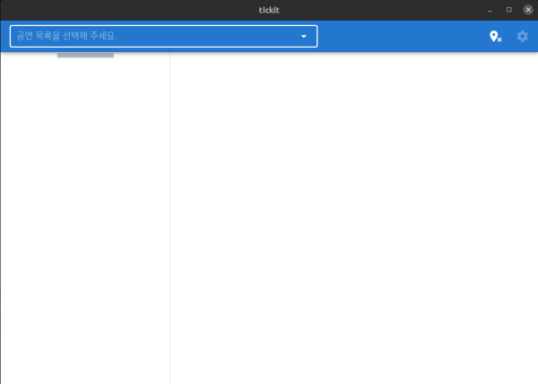

# tickit



인터파크 같은 사이트에 간간이 들러서 뭐 새로운 공연 있나 확인할 때 어려운 점은 최근 추가된 공연만 따로 볼 방법이 없다는 점입니다. 그래서 안 볼 공연들이 잔뜩 포함된 긴 목록을 매번 훑어야 합니다.

이 프로그램에선 세 목록에서 공연 항목들을 이리저리 옮길 수 있습니다. 예를 들어 관심 없는 공연은 왼쪽 목록으로 보내고, 예매를 마친 공연은 오른쪽 목록으로 옮길 수 있습니다. 가운데 목록이 짧아졌으니 며칠 후 새 공연을 확인하기 쉬워집니다.

현재 다음 사이트들의 공연 목록을 볼 수 있습니다.

* 인터파크

Electron 앱 형태로 실행하는 걸 상정합니다. 이 경우 앱 안에서 예매를 할 수 없습니다.

Vue 개발 서버에서 돌려 볼 수도 있습니다. 이 경우 인터파크의 공연들만 볼 수 있습니다.

직접 빌드할 수도 있습니다.

```
yarn install
yarn electron:build
```

`dist_electron` 디렉터리에 실행 파일이 생깁니다.
